# Global Logistics Management System (GLMS)

> **Student Number:** ST10445500

---

## Table of Contents

- [What is GLMS?](#what-is-glms)
- [Running the App](#running-the-app)
- [Default Demo Users](#default-demo-users)
- [Screenshots](#screenshots)
- [How the Project Evolved](#how-the-project-evolved)
- [Final Architecture](#final-architecture)
- [Tech Stack](#tech-stack)
- [Docker & Containerisation](#docker--containerisation)
- [Testing](#testing)
- [Project Structure](#project-structure)
- [Key API Endpoints](#key-api-endpoints)
- [YouTube Video Link](#youtube-video-link)
- [References](#references)
- [AI Assistance Declaration](#ai-assistance-declaration)

---

## What is GLMS?

**TechMove Logistics** is a fictional global freight coordinator that was still relying on spreadsheets, email threads, and manual phone calls. For this project, I built **GLMS** as an enterprise-style system that could manage clients, contracts, service requests, and international invoicing in a more structured way.

I developed the project across three POE parts. It started as an architecture report, became a working ASP.NET Core MVC prototype, and then evolved into a containerised, service-oriented .NET solution with a separate API backend, MVC frontend, automated tests, and Docker Compose deployment.

The system lets TechMove staff:

- Manage clients, contracts, and signed agreement documents
- Create and track service requests linked to specific contracts
- Automatically block service requests for expired or on-hold contracts
- Convert foreign currency amounts to ZAR using an external exchange-rate API
- Sign in with role-based access for Admin, ContractManager, and LogisticsManager users
- Run the database, API, and frontend together with Docker Compose

---

## Running the App

I recommend running the project with Docker Compose because it starts the SQL Server database, API, and MVC frontend together.

Make sure Docker Desktop is running, then run this from the repo root:

```powershell
docker compose up --build
```

Then open:

- **MVC Frontend:** `http://localhost:5004`
- **API Swagger UI:** `http://localhost:5053/swagger`

To stop everything:

```powershell
docker compose down
```

To do a full reset, including wiping the database and uploaded files:

```powershell
docker compose down -v
```

> The `.env` file supplies demo values such as the SA password and JWT key. I would not use these as real production secrets; they are included for local demo and marking purposes.

---

## Default Demo Users

The seed data creates three demo accounts on first startup:

| Role | Email | Password |
|------|-------|----------|
| `Admin` | `admin@glms.co.za` | `Admin1234!` |
| `ContractManager` | `contracts@glms.co.za` | `User1234!` |
| `LogisticsManager` | `logistics@glms.co.za` | `User1234!` |

These accounts are for demo and marking purposes only.

### What each role can do:

| Action | Admin | ContractManager | LogisticsManager |
|--------|:-----:|:---------------:|:----------------:|
| View clients, contracts, and service requests | Yes | Yes | Yes |
| Create / edit clients and contracts | Yes | Yes | No |
| Upload signed agreement PDFs | Yes | Yes | No |
| Update contract statuses | Yes | Yes | No |
| Create service requests | Yes | No | Yes |
| Update service request statuses | Yes | No | Yes |
| Use currency conversion | Yes | No | Yes |
| Manage users | Yes | No | No |
| Delete clients, contracts, and service requests | Yes | No | No |

---

## Screenshots

### Login & Dashboard

| Login Page | Dashboard (Admin View) |
|:----------:|:----------------------:|
| 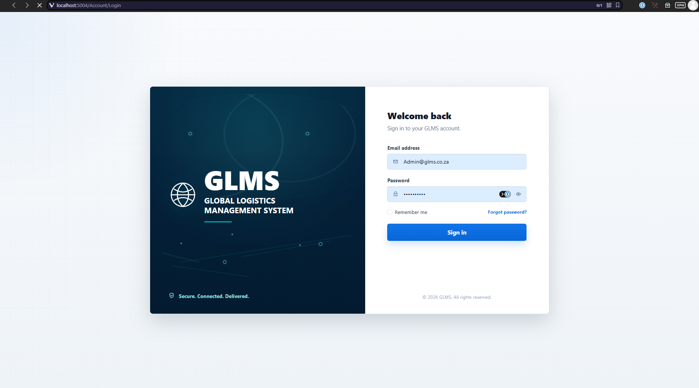 | 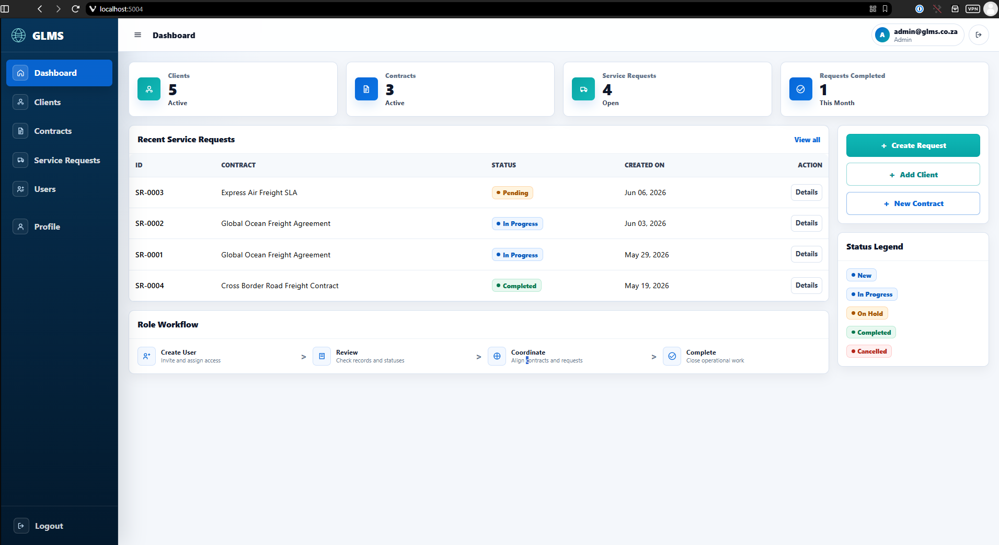 |

### Client & Contract Management

| Clients List | Client Detail |
|:------------:|:-------------:|
| 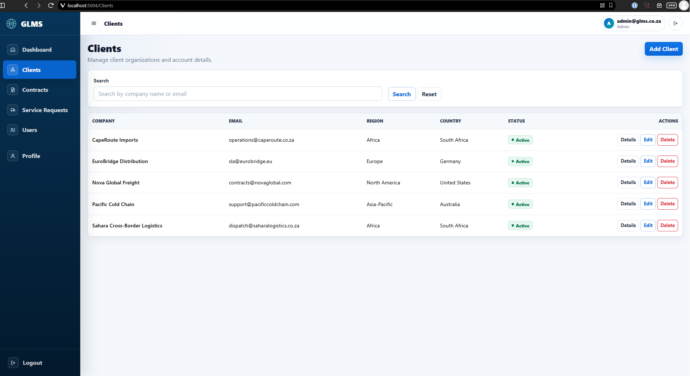 | 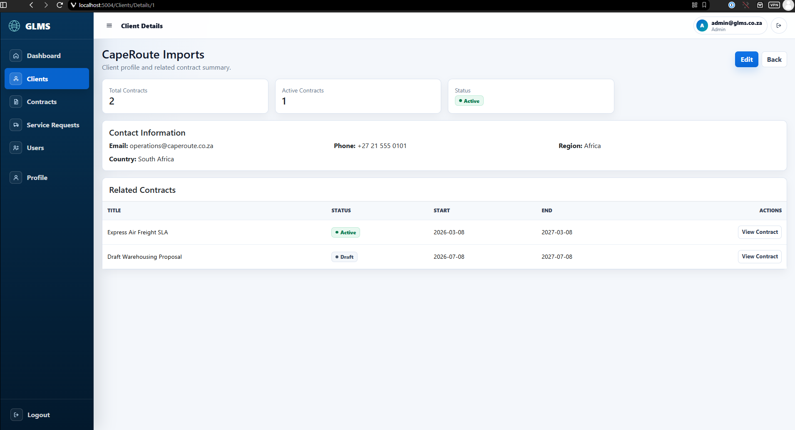 |

| Contracts List | Contract Detail |
|:--------------:|:---------------:|
| 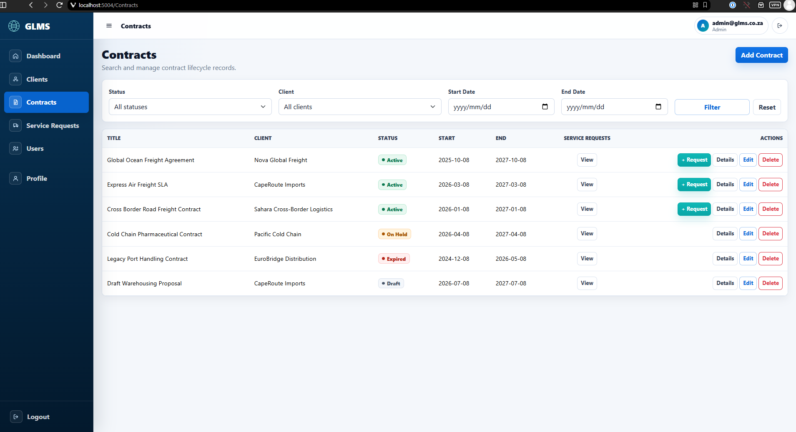 | 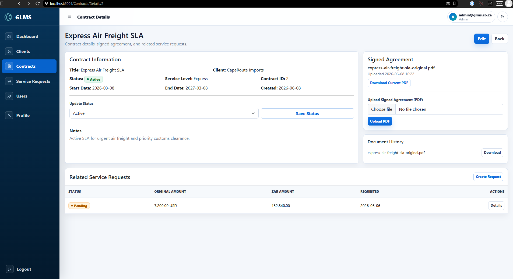 |

### Signed Agreement Document

| Signed Agreement Download |
|:-------------------------:|
| 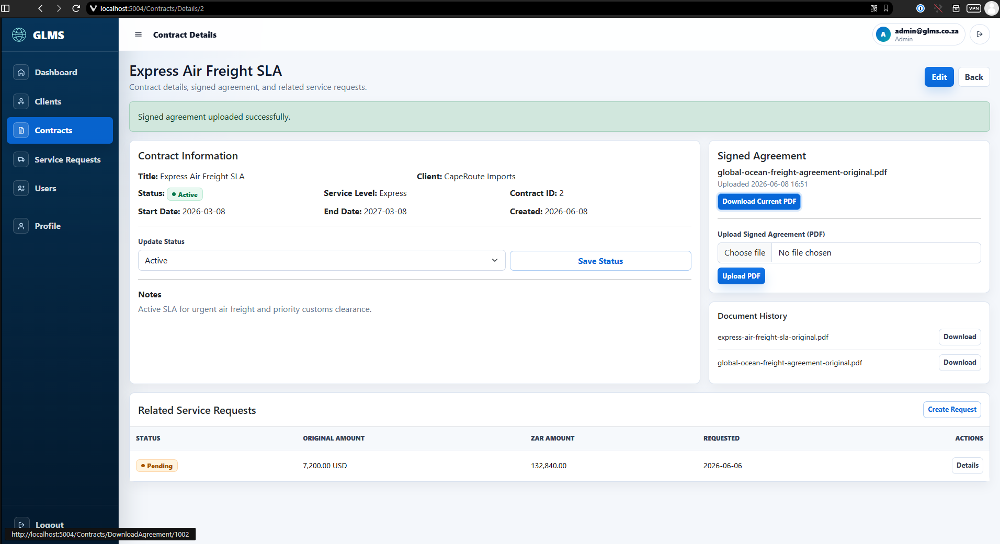 |

### Service Requests & Currency Conversion

| Service Request Form with ZAR Conversion | Service Requests List |
|:----------------------------------------:|:---------------------:|
| 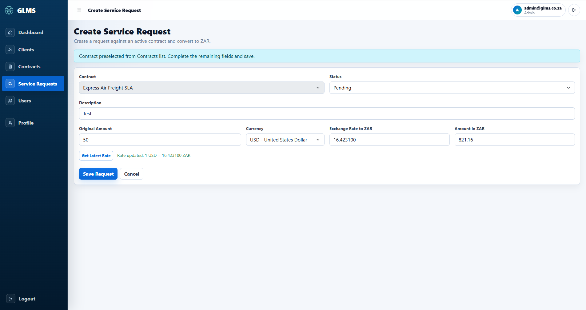 | 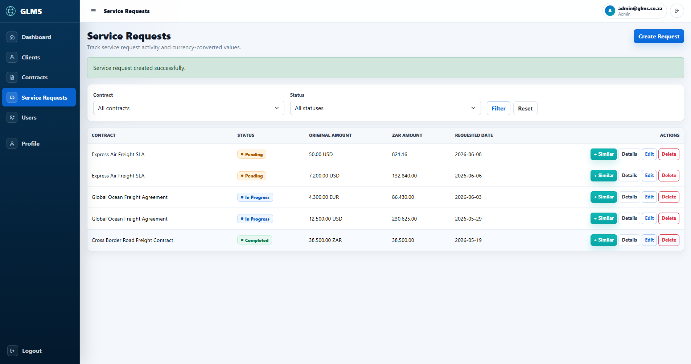 |

### Swagger / API Documentation

| Swagger Endpoint List | Expanded Endpoint Example |
|:---------------------:|:-------------------------:|
| 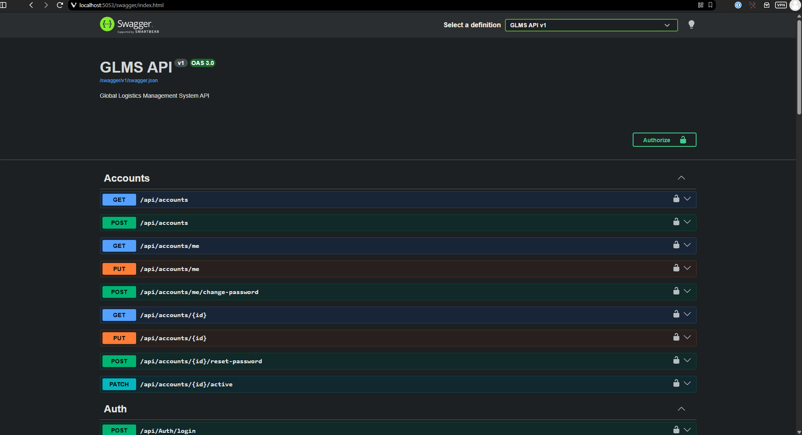 | 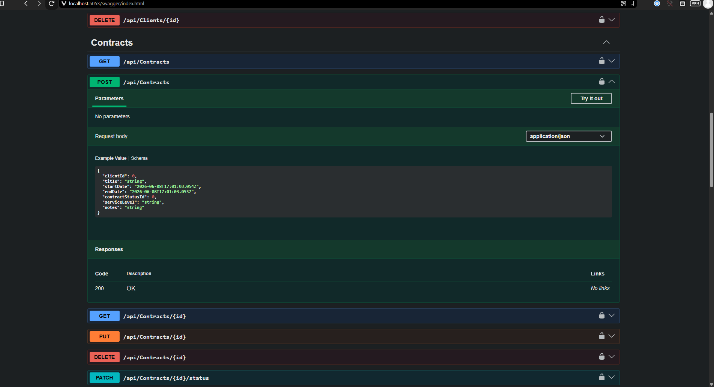 |

### Automated Tests - Local & CI

| Local Tests Passing | GitHub Actions CI Passing |
|:-------------------:|:-------------------------:|
| 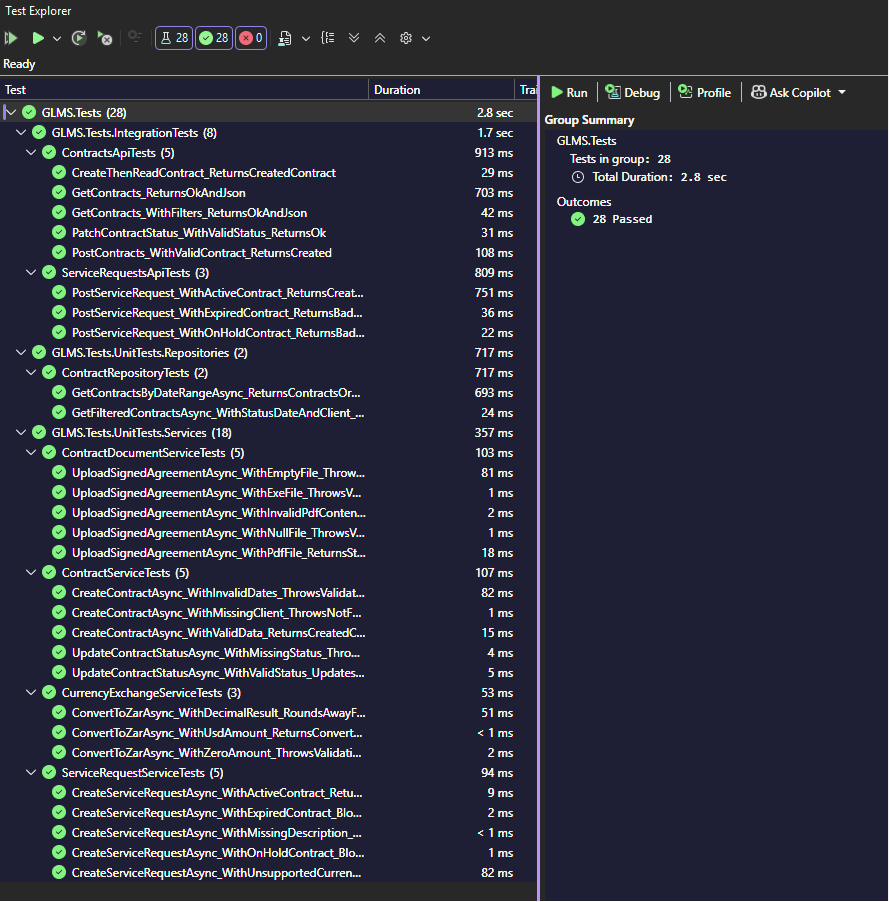 | 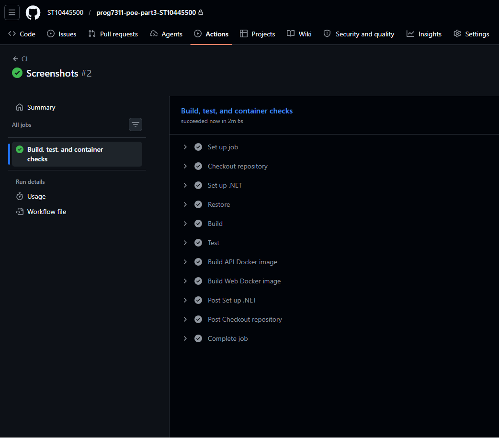 |

### Docker Desktop

| Containers Running | Docker Volumes |
|:------------------:|:--------------:|
| 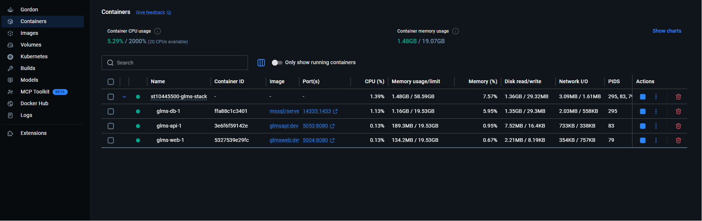 | 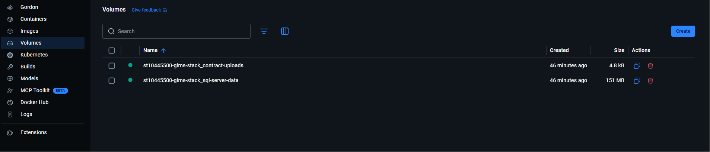 |

---

## How the Project Evolved

I built the project in three parts, with each part building on the previous one:

| Part | What I Built |
|------|--------------|
| **Part 1 - Architecture Report** | I designed the system, chose the Zachman enterprise framework, selected GoF design patterns, and planned scalability strategies. This part was the blueprint before coding started. |
| **Part 2 - Core Prototype** | I built a working ASP.NET Core MVC monolith with clients, contracts, service requests, PDF uploads, currency conversion, and unit tests. |
| **Part 3 - Modernisation** | I refactored the project into a service-oriented architecture by splitting the backend into its own Web API, containerising the stack with Docker Compose, and adding integration tests. |

---

## Final Architecture

The final version is a three-tier, service-oriented system:

```text
Browser
  |
  v
GLMS.Web  (ASP.NET Core MVC frontend)
  |  calls via HttpClient / JSON
  v
GLMS.Api  (ASP.NET Core Web API backend)
  |  queries via Entity Framework Core
  v
SQL Server database
```

**Why I split it up:** the MVC frontend no longer talks to the database directly. It sends HTTP requests to the API, and the API owns the business rules, validation, file handling, authentication, and database access. This makes the frontend and backend easier to deploy, scale, and update independently.

### Projects in the Solution

| Project | Purpose |
|---------|---------|
| `GLMS.Api` | Web API backend that handles database access, business logic, authentication, and JSON endpoints. |
| `GLMS.Web` | MVC frontend with Razor views, form handling, and typed `HttpClient` API clients. |
| `GLMS.Tests` | xUnit unit and integration tests. |

---

## Tech Stack

| Layer | Technology | Why I Used It |
|-------|------------|---------------|
| **Backend Framework** | ASP.NET Core Web API (`.NET 10`) | It is strongly typed, performant, and suitable for building enterprise-style .NET APIs. |
| **Frontend Framework** | ASP.NET Core MVC | Razor views and controller-based routing kept the UI layer separate from the API and database logic. |
| **ORM / Database Access** | Entity Framework Core + SQL Server | EF Core gave me code-first migrations, LINQ queries, and clean relationships without writing raw SQL everywhere. |
| **Authentication** | ASP.NET Core Identity + JWT Bearer | Identity manages users and roles, while JWT tokens allow the API to authenticate requests without server-side sessions. |
| **API Documentation** | Swagger / OpenAPI (Swashbuckle) | Swagger provides interactive API documentation and makes endpoints easier to test during development. |
| **Currency Conversion** | Frankfurter API (external) | Frankfurter is a free exchange-rate API that does not require an API key, and I used it to convert foreign currency values to ZAR. |
| **Testing** | xUnit + WebApplicationFactory | xUnit handles the tests, and `WebApplicationFactory` lets the integration tests call the API in memory. |
| **Test Database** | EF Core InMemory Provider | The test suite can run with a clean isolated database without needing a live SQL Server instance. |
| **Containerisation** | Docker + Docker Compose | Docker packages the API, MVC app, and SQL Server into containers that can run together in a repeatable way. |

---

## Docker & Containerisation

### Why Docker?

One of the biggest problems in software development is the classic *"it works on my machine"* issue. A developer's laptop, a lecturer's PC, and a cloud server can all have different operating systems, installed tools, and configuration values.

Docker helps solve this by packaging an application and its runtime dependencies into a container image. Docker Compose then lets me define the database, API, and frontend containers in one `docker-compose.yml` file and start the full stack with one command.

### My Docker Setup

```text
docker-compose.yml
  |-- glms-db       -> SQL Server 2022 database container
  |-- glms-api      -> ASP.NET Core Web API container
  `-- glms-web      -> ASP.NET Core MVC frontend container
```

The containers communicate through Docker's internal network. The API connects to SQL Server using the service name `glms-db`, and the MVC frontend connects to the API using `http://glms-api:8080/`. This keeps the container setup portable instead of depending on local machine paths or localhost-only connections.

Persistent data is handled with Docker volumes:

- `sql-server-data` keeps the SQL Server database data between restarts.
- `contract-uploads` stores uploaded signed agreement PDFs.

### Running with Docker

The Docker Compose commands are listed near the top of the README in [Running the App](#running-the-app), so the setup steps are easy to find before logging in.

---

## Testing

Tests live in `GLMS.Tests` and use **xUnit**.

```powershell
dotnet test .\GLMS.Tests\GLMS.Tests.csproj
```

**Latest result: 28/28 tests passing**

### Unit tests cover:

- Contract service validation logic
- Service request business rules
- Blocking requests against Expired and On Hold contracts
- PDF upload validation, including PDF-only checks, header checks, and path safety
- Currency conversion math and error handling
- Repository filtering behaviour

### Integration tests cover:

- Real HTTP calls to API endpoints through `WebApplicationFactory`
- Correct HTTP status codes and JSON responses
- End-to-end flows such as create, read, and verify

The integration tests use an InMemory database, fake authentication, and a fake currency service. That means they are isolated and repeatable without needing a running SQL Server instance or a live call to the Frankfurter API.

The repo also includes a GitHub Actions CI workflow at `.github/workflows/CI.yml`. It runs restore, build, test, and Docker image build checks on pushes and pull requests to `main`.

See the [Automated Tests screenshots](#automated-tests---local--ci) above for the local and CI test evidence.

---

## Project Structure

```text
prog7311-poe-part3-ST10445500/
  GLMS-POE.slnx
  docker-compose.yml
  .env
  docs/
    screenshots/          README screenshots

  GLMS.Api/               Web API backend
    Controllers/          API endpoints
    Data/
      Repositories/       Database query logic
      Seeding/            Demo data on startup
    DTOs/                 Data shapes in and out of the API
    Models/               EF Core entities
    Services/             Business rules and validation
    Migrations/           EF Core database migrations
    uploads/              Uploaded signed agreement PDFs
    Dockerfile

  GLMS.Web/               MVC frontend
    ApiClients/           HttpClient wrappers for each API area
    Controllers/          MVC controllers
    ViewModels/           Data shapes for Razor views
    Views/                Razor pages
    Dockerfile

  GLMS.Tests/             Test project
    UnitTests/
    IntegrationTests/
    Helpers/
```

---

## Key API Endpoints

| Method | Route | What it does |
|--------|-------|--------------|
| `POST` | `/api/auth/login` | Logs in and returns a JWT token. |
| `GET` | `/api/clients` | Lists all clients. |
| `GET` | `/api/contracts` | Lists contracts and supports filtering by status and date. |
| `POST` | `/api/contracts` | Creates a new contract. |
| `PATCH` | `/api/contracts/{id}/status` | Updates a contract status. |
| `POST` | `/api/contracts/{id}/signed-agreement` | Uploads a signed agreement PDF for a contract. |
| `GET` | `/api/contracts/documents/{documentId}/download` | Downloads a signed agreement PDF. |
| `GET` | `/api/service-requests` | Lists service requests. |
| `POST` | `/api/service-requests` | Creates a service request after validating the contract status. |
| `GET` | `/api/service-requests/exchange-rate` | Gets a live exchange rate for ZAR conversion. |
| `GET` | `/api/lookups/contract-statuses` | Gets the available contract status options. |

Swagger UI is available at `/swagger` when the API runs in Development mode.

See the [Swagger screenshots](#swagger--api-documentation) above for what this looks like in the browser.

---

## YouTube Video Link

https://youtu.be/O15G2dXdf_c

---

## References

Frankfurter. (2026). *Frankfurter*. [online] Available at: https://frankfurter.dev/ [Accessed 8 Jun. 2026].

gewarren. (2025). *HttpClient guidelines for .NET - .NET*. [online] Microsoft.com. Available at: https://learn.microsoft.com/en-us/dotnet/fundamentals/networking/http/httpclient-guidelines [Accessed 8 Jun. 2026].

Gudmestad, E. (2024). *ASP.NET Core MVC Tutorial - Full Course to Build YOUR Passion Project!* [online] YouTube. Available at: https://www.youtube.com/watch?v=q9X3SDEZtpw [Accessed 8 Jun. 2026].

Iulian Oana. (2021). *Beginners ASP.NET Core Identity Tutorial*. [online] YouTube. Available at: https://www.youtube.com/watch?v=5UfJeDcoC1k [Accessed 8 Jun. 2026].

meaghanlewis. (2026). *Testing in .NET - .NET*. [online] Microsoft.com. Available at: https://learn.microsoft.com/en-us/dotnet/core/testing/ [Accessed 8 Jun. 2026].

SamMonoRT. (2024). *Overview of Entity Framework Core - EF Core*. [online] Microsoft.com. Available at: https://learn.microsoft.com/en-us/ef/core/ [Accessed 8 Jun. 2026].

tdykstra. (2025). *Integration tests in ASP.NET Core*. [online] Microsoft.com. Available at: https://learn.microsoft.com/en-us/aspnet/core/test/integration-tests?view=aspnetcore-10.0&pivots=xunit [Accessed 8 Jun. 2026].

wadepickett. (2025). *Introduction to Identity on ASP.NET Core*. [online] Microsoft.com. Available at: https://learn.microsoft.com/en-us/aspnet/core/security/authentication/identity?view=aspnetcore-10.0 [Accessed 8 Jun. 2026].

---

## AI Assistance Declaration

AI tools were used as support during the project, but I reviewed and adjusted the final implementation and testing myself.

- **GitHub Copilot** was used to assist with the testing setup and to help define the scope of the automated tests.
- **ChatGPT** was used to assist with generating site style visuals and styling ideas for the login page and related frontend presentation.
- **ChatGPT** was used to assist with the formatting and style visuals of the README document.

---
