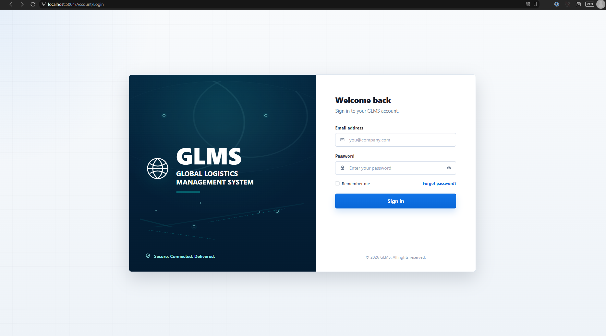

# 🌐 Global Logistics Management System (GLMS)

> **PROG7311 / EAPD7111 - Programming 3A & Enterprise Application Development**


> **Student Number:** ST10445500

---

## 📑 Table of Contents

- [What is GLMS?](#-what-is-glms)
- [Screenshots](#-screenshots)
- [How the Project Evolved](#-how-the-project-evolved)
- [Final Architecture](#-final-architecture)
- [Tech Stack](#️-tech-stack)
- [Docker & Containerisation](#-docker--containerisation)
- [Running Locally (Without Docker)](#️-running-locally-without-docker)
- [Testing](#-testing)
- [Default Demo Users](#-default-demo-users)
- [Project Structure](#-project-structure)
- [Key API Endpoints](#-key-api-endpoints)
- [Design Decisions Worth Noting](#-design-decisions-worth-noting)
- [YouTube Video Link](#-youtube-video-link)

---

## 📋 What is GLMS?

**TechMove Logistics** is a fictional global freight coordinator drowning in spreadsheets, email threads, and manual phone calls. They needed something better — a proper enterprise system to manage clients, contracts, service requests, and international invoicing.

**GLMS** is that system. Built across three POE parts, it evolved from an architecture report → a working prototype → a fully containerised, service-oriented web application. The final product is a real multi-project .NET solution with a decoupled API backend, an MVC frontend, automated tests, and Docker Compose deployment.

The system lets TechMove staff:

- Manage clients, contracts, and signed agreement documents
- Create and track service requests tied to specific contracts
- Block service requests against expired or on-hold contracts automatically
- Convert foreign currency amounts to ZAR in real time via an external API
- Sign in with role-based access (Admin, ContractManager, LogisticsManager)
- Run and test everything with a single Docker Compose command

---

## 📸 Screenshots

### Login & Dashboard

> 📷 **Screenshot instructions:** Capture the login page, then log in as Admin and capture the main dashboard/home page. Place them side by side below.

| Login Page | Dashboard (Admin View) |
|:----------:|:----------------------:|
|  |  |
| *Screenshot: the GLMS login screen — navigate to `http://localhost:5004` and capture before logging in* | *Screenshot: the main dashboard or landing page after logging in as `admin@glms.co.za`* |

---

### Client & Contract Management

> 📷 **Screenshot instructions:** Capture the clients list, then open one contract to show its details page (with the status badge and linked service requests visible).

| Clients List | Contract Detail Page |
|:------------:|:--------------------:|
|  |  |
| *Screenshot: the full clients list/table — shows company name, region, country* | *Screenshot: a single contract's detail page — status badge (Active/Draft), linked service requests, and the signed agreement download link* |

---

### Signed Agreement PDF Upload

> 📷 **Screenshot instructions:** Show the PDF upload form on a contract, then show the success state with the download link appearing after upload.

| Upload Form | After Upload — Download Link |
|:-----------:|:----------------------------:|
|  |  |
| *Screenshot: the "Upload Signed Agreement" form — file picker visible, before submitting* | *Screenshot: the contract page after a PDF has been uploaded — the download link / file name should be visible* |

---

### Service Requests & Currency Conversion

> 📷 **Screenshot instructions:** Show the service request creation form with the currency conversion in action (type a USD amount and capture the ZAR conversion appearing). Also capture the service requests list.

| Service Request Form (with ZAR conversion) | Service Requests List |
|:-------------------------------------------:|:---------------------:|
|  |  |
| *Screenshot: the "Create Service Request" form — type a USD amount so the live ZAR conversion value is visible on screen* | *Screenshot: the service requests table/list — shows status badges, linked contract names, and ZAR amounts* |

---

### Blocked Service Request (Business Rule in Action)

> 📷 **Screenshot instructions:** Find a contract with status "Expired" or "On Hold", then try to create a service request against it. Capture the validation error message that blocks you.

| Validation Error — Expired Contract |
|:------------------------------------:|
|  |
| *Screenshot: the error/validation message shown when trying to create a service request against an Expired or On Hold contract — this demonstrates the core business rule working* |

---

### Swagger / API Documentation

> 📷 **Screenshot instructions:** Open `http://localhost:5053/swagger` and capture the full Swagger UI showing the list of endpoints. Then expand one endpoint (e.g. `POST /api/contracts`) and capture it with the request body schema visible.

| Swagger Endpoint List | Expanded Endpoint Example |
|:---------------------:|:-------------------------:|
|  |  |
| *Screenshot: the Swagger UI landing page — scroll to show as many endpoint groups as possible (auth, clients, contracts, service-requests)* | *Screenshot: one endpoint expanded in Swagger (e.g. `POST /api/contracts`) — show the request body schema or a successful response* |

---

### Automated Tests — All Passing

> 📷 **Screenshot instructions:** Run `dotnet test .\GLMS.Tests\GLMS.Tests.csproj` in the terminal and capture the output showing all tests green. Also capture the Visual Studio Test Explorer if you have it open.

| Terminal — Tests Passing | Visual Studio Test Explorer |
|:------------------------:|:---------------------------:|
|  |  |
| *Screenshot: terminal output of `dotnet test` — should show `28 passed, 0 failed`* | *Screenshot: VS Test Explorer with all tests green — expand the tree so unit and integration tests are both visible* |

---

### Docker Desktop — Containers Running

> 📷 **Screenshot instructions:** Run `docker compose up --build`, then open Docker Desktop. Capture the Containers view showing all three containers (glms-db, glms-api, glms-web) running with green status indicators.

| Docker Desktop — All Containers Running |
|:---------------------------------------:|
|  |
| *Screenshot: Docker Desktop "Containers" tab — all three containers (`glms-db`, `glms-api`, `glms-web`) should show green/running status. Ideally widen the window so the port mappings are visible too* |

> 📷 **Bonus:** Also capture the **Volumes** tab in Docker Desktop showing `sql-server-data` and `contract-uploads` volumes existing.

| Docker Volumes |
|:--------------:|
|  |
| *Screenshot: Docker Desktop "Volumes" tab — shows `sql-server-data` and `contract-uploads` volumes created by Docker Compose* |

---

> 💡 **Tip:** Store all screenshots in a `docs/screenshots/` folder in the repo root and name them exactly as referenced above so the images load correctly on GitHub.

---

## 🏗️ How the Project Evolved

This project was built in three parts, each building on the last:

| Part | What We Did |
|------|------------|
| **Part 1 — Architecture Report** | Designed the system. Chose an enterprise framework (Zachman/TOGAF), selected GoF design patterns, defined scalability strategies. No code yet — just the blueprint. |
| **Part 2 — Core Prototype** | Built a working ASP.NET Core MVC monolith. Clients, contracts, service requests, PDF uploads, currency conversion, unit tests. Everything in one project. |
| **Part 3 — Modernisation** | Refactored into a proper Service-Oriented Architecture. Split the backend out into its own Web API. Containerised everything with Docker Compose. Added integration tests. |

---

## 🧱 Final Architecture

The final version is a three-tier, service-oriented system:

```
Browser
  │
  ▼
GLMS.Web  (ASP.NET Core MVC Frontend)
  │  calls via HttpClient / JSON
  ▼
GLMS.Api  (ASP.NET Core Web API Backend)
  │  queries via Entity Framework Core
  ▼
SQL Server Database
```

**Why split it up?**
The MVC frontend no longer talks to the database directly. It sends HTTP requests to the API, which owns all the business rules, validation, file handling, and database access. This means the two layers can be deployed, scaled, and updated independently — which is the whole point of a Service-Oriented Architecture.

### Projects in the Solution

| Project | Purpose |
|---------|---------|
| `GLMS.Api` | Web API backend — all database access, business logic, authentication, and JSON endpoints live here. |
| `GLMS.Web` | MVC frontend — Razor views, form handling, and typed `HttpClient` API clients. No SQL here. |
| `GLMS.Tests` | xUnit unit and integration tests. |

---

## 🛠️ Tech Stack

| Layer | Technology | Why We Used It |
|-------|-----------|----------------|
| **Backend Framework** | ASP.NET Core Web API (`.NET 10`) | Industry-standard, performant, strongly typed. The obvious choice for enterprise .NET backends. |
| **Frontend Framework** | ASP.NET Core MVC | Razor views with controller-based routing. Keeps the UI layer clean and separate from data logic. |
| **ORM / Database Access** | Entity Framework Core + SQL Server | Code-first migrations, LINQ queries, and clean entity relationships without writing raw SQL. |
| **Authentication** | ASP.NET Core Identity + JWT Bearer | Identity manages users and roles; JWT tokens let the API authenticate requests without sessions. |
| **API Documentation** | Swagger / OpenAPI (Swashbuckle) | Auto-generates interactive API docs. Makes testing endpoints dead-simple without needing Postman. |
| **Currency Conversion** | Frankfurter API (external) | Free, reliable exchange-rate API. No key required. Used to convert foreign currency amounts to ZAR in real time. |
| **Testing** | xUnit + WebApplicationFactory | xUnit for unit tests; `WebApplicationFactory` spins up the real API in memory for integration tests. |
| **Test Database** | EF Core InMemory Provider | Gives tests a clean, isolated database without needing a running SQL Server instance. |
| **Containerisation** | Docker + Docker Compose | Packages the API, MVC app, and SQL Server into isolated containers that run the same way everywhere. |

---

## 🐳 Docker & Containerisation

### Why Docker?

One of the biggest problems in software development is *"it works on my machine."* A developer's laptop, a lecturer's PC, and a cloud server all have different operating systems, software versions, and configurations — which means code that works in one place can silently break in another.

**Docker solves this** by packaging your application and everything it needs (runtime, dependencies, configuration) into a single **container image**. That image runs identically on any machine that has Docker installed.

**Docker Compose** takes it a step further — it lets you define multiple containers (database, API, frontend) in a single `docker-compose.yml` file and bring the whole stack up with one command.

### Our Docker Setup

```
docker-compose.yml
  ├── glms-db       → SQL Server 2022 database container
  ├── glms-api      → ASP.NET Core Web API (connects to glms-db)
  └── glms-web      → ASP.NET Core MVC frontend (connects to glms-api)
```

The containers communicate using Docker's internal networking — the API doesn't use `localhost` to find the database, it uses the service name `glms-db`. The frontend doesn't use `localhost` to find the API, it uses `http://glms-api:8080/`. This keeps everything portable.

**Persistent data** is handled with Docker volumes:
- `sql-server-data` — keeps the database alive between restarts
- `contract-uploads` — stores uploaded signed agreement PDFs

### Running with Docker (Recommended)

Make sure Docker Desktop is running, then from the repo root:

```powershell
docker compose up --build
```

Then open:
- **MVC Frontend:** `http://localhost:5004`
- **API Swagger UI:** `http://localhost:5053/swagger`

To stop everything:
```powershell
docker compose down
```

To do a full reset (wipes the database and uploaded files):
```powershell
docker compose down -v
```

> ⚠️ The `.env` file supplies secrets like the SA password and JWT key. Do not commit real production secrets. The defaults are for demo/marking purposes only.

---

## ▶️ Running Locally (Without Docker)

If you'd rather run it without Docker, you'll need a local SQL Server instance and the right config values in `appsettings.Development.json`.

**1. Restore and build:**
```powershell
dotnet restore
dotnet build .\GLMS-POE.slnx
```

**2. Run the API** (in one terminal):
```powershell
dotnet run --project .\GLMS.Api\GLMS.Api.csproj
```

**3. Run the MVC frontend** (in another terminal):
```powershell
dotnet run --project .\GLMS.Web\GLMS.Web.csproj
```

Local URLs:
- API: `http://localhost:64083` (+ Swagger at `/swagger`)
- Frontend: `http://localhost:64081`

---

## 🧪 Testing

Tests live in `GLMS.Tests` and use **xUnit**.

```powershell
dotnet test .\GLMS.Tests\GLMS.Tests.csproj
```

**Latest result: ✅ 28/28 tests passing**

### Unit Tests cover:
- Contract service validation logic
- Service request business rules
- Blocking requests against Expired and On Hold contracts
- PDF upload validation (PDF-only, header checks, path safety)
- Currency conversion math and error handling
- Repository filtering behaviour

### Integration Tests cover:
- Real HTTP calls to API endpoints via `WebApplicationFactory`
- Asserting correct HTTP status codes and JSON responses
- End-to-end flows (create → read → verify)

Integration tests use an **InMemory database**, fake authentication, and a fake currency service — so they're fully isolated and repeatable without needing a live SQL Server or the external Frankfurter API.

**Why does automated testing matter?**
In a real DevOps pipeline, these tests run automatically every time code is pushed. If a change breaks an existing feature, the tests catch it before it reaches production. The repo includes a **GitHub Actions CI workflow** (`.github/workflows/CI.yml`) that runs restore, build, and test on every push.

> 📷 *See the [Screenshots → Automated Tests](#automated-tests--all-passing) section above for test output evidence.*

---

## 🔑 Default Demo Users

The seed data creates three demo accounts on first startup:

| Role | Email | Password |
|------|-------|----------|
| `Admin` | `admin@glms.co.za` | `Admin1234!` |
| `ContractManager` | `contracts@glms.co.za` | `User1234!` |
| `LogisticsManager` | `logistics@glms.co.za` | `User1234!` |

These are for **demo and marking purposes only**.

### What each role can do:

| Action | Admin | ContractManager | LogisticsManager |
|--------|:-----:|:---------------:|:----------------:|
| View clients, contracts, service requests | ✅ | ✅ | ✅ |
| Create / edit clients and contracts | ✅ | ✅ | ❌ |
| Upload signed agreement PDFs | ✅ | ✅ | ❌ |
| Update contract statuses | ✅ | ✅ | ❌ |
| Create service requests | ✅ | ❌ | ✅ |
| Update service request statuses | ✅ | ❌ | ✅ |
| Use currency conversion | ✅ | ❌ | ✅ |
| Manage users | ✅ | ❌ | ❌ |
| Delete records | ✅ | ❌ | ❌ |

---

## 📁 Project Structure

```
prog7311-poe-part3-ST10445500/
  GLMS-POE.slnx
  docker-compose.yml
  .env
  docs/
    screenshots/          ← all README screenshots go here

  GLMS.Api/               ← Web API backend
    Controllers/          ← API endpoints
    Data/
      Repositories/       ← Database query logic
      Seeding/            ← Demo data on startup
    DTOs/                 ← Data shapes in/out of the API
    Models/               ← EF Core entities
    Services/             ← Business rules and validation
    Migrations/           ← EF Core database migrations
    uploads/              ← Uploaded signed agreement PDFs
    Dockerfile

  GLMS.Web/               ← MVC frontend
    ApiClients/           ← HttpClient wrappers for each API area
    Controllers/          ← MVC controllers
    ViewModels/           ← Data shapes for Razor views
    Views/                ← Razor pages
    Dockerfile

  GLMS.Tests/             ← Test project
    UnitTests/
    IntegrationTests/
    Helpers/
```

---

## 🌐 Key API Endpoints

| Method | Route | What it does |
|--------|-------|-------------|
| `POST` | `/api/auth/login` | Log in and get a JWT token |
| `GET` | `/api/clients` | List all clients |
| `GET` | `/api/contracts` | List contracts (supports filtering by status and date) |
| `POST` | `/api/contracts` | Create a new contract |
| `PATCH` | `/api/contracts/{id}/status` | Update contract status |
| `POST` | `/api/contracts/{id}/signed-agreement` | Upload a signed agreement PDF |
| `GET` | `/api/contracts/documents/{id}/download` | Download a signed agreement PDF |
| `GET` | `/api/service-requests` | List service requests |
| `POST` | `/api/service-requests` | Create a service request (validated against contract status) |
| `GET` | `/api/service-requests/exchange-rate` | Get live ZAR exchange rate |
| `GET` | `/api/lookups/contract-statuses` | Get available contract status options |

Swagger UI is available at `/swagger` when the API runs in Development mode.

> 📷 *See the [Screenshots → Swagger](#swagger--api-documentation) section above for what this looks like in the browser.*

---

## 💡 Design Decisions Worth Noting

**Why did we start with a monolith (Part 2) before splitting it up (Part 3)?**
Building a monolith first is actually a standard, recommended approach for MVPs. You get all the core logic working and tested in one place before you worry about separation. The refactor in Part 3 was intentional — once we knew the business logic was solid, we separated it cleanly into an API backend and an MVC frontend.

**Why Service-Oriented Architecture?**
It means the frontend and backend can be deployed, scaled, and updated independently. If TechMove suddenly needs to support a mobile app, it just calls the same API. The MVC project is just one possible frontend.

**Why EF Core over raw SQL?**
Code-first migrations mean the database schema stays in sync with the C# models automatically. LINQ queries are type-safe, which reduces bugs. And it's much faster to iterate on during development.

**Why JWT over cookie-based sessions?**
JWTs are stateless — the API doesn't need to store session data. This makes the API easier to scale horizontally (multiple instances don't need to share session state). It also makes Swagger testing straightforward: paste the token in once and all protected endpoints work.

---

## 🎥 YouTube Video Link

https://youtu.be/O15G2dXdf_c

---

## 🤖 AI Assistance Declaration

AI tools were used as support during the project, but the final implementation and testing reviewed and adjusted by myself.

* **GitHub Copilot** was used to assist with the testing setup and to help define the scope of the automated tests.
* **ChatGPT** was used to assist with generating site style visuals and styling ideas for the login page and related frontend presentation.
* **ChatGPT** was used to assist with the formatting and style visuals of the README doc.

---

## 📚 References

Frankfurter. (2026). *Frankfurter*. [online] Available at: https://frankfurter.dev/ [Accessed 8 Jun. 2026].

gewarren. (2025). *HttpClient guidelines for .NET - .NET*. [online] Microsoft.com. Available at: https://learn.microsoft.com/en-us/dotnet/fundamentals/networking/http/httpclient-guidelines [Accessed 8 Jun. 2026].

Gudmestad, E. (2024). *ASP.NET Core MVC Tutorial – Full Course to Build YOUR Passion Project!* [online] YouTube. Available at: https://www.youtube.com/watch?v=q9X3SDEZtpw [Accessed 8 Jun. 2026].

Iulian Oana. (2021). *Beginners ASP.NET Core Identity Tutorial*. [online] YouTube. Available at: https://www.youtube.com/watch?v=5UfJeDcoC1k [Accessed 8 Jun. 2026].

meaghanlewis. (2026). *Testing in .NET - .NET*. [online] Microsoft.com. Available at: https://learn.microsoft.com/en-us/dotnet/core/testing/ [Accessed 8 Jun. 2026].

SamMonoRT. (2024). *Overview of Entity Framework Core - EF Core*. [online] Microsoft.com. Available at: https://learn.microsoft.com/en-us/ef/core/ [Accessed 8 Jun. 2026].

tdykstra. (2025). *Integration tests in ASP.NET Core*. [online] Microsoft.com. Available at: https://learn.microsoft.com/en-us/aspnet/core/test/integration-tests?view=aspnetcore-10.0&pivots=xunit [Accessed 8 Jun. 2026].

wadepickett. (2025). *Introduction to Identity on ASP.NET Core*. [online] Microsoft.com. Available at: https://learn.microsoft.com/en-us/aspnet/core/security/authentication/identity?view=aspnetcore-10.0 [Accessed 8 Jun. 2026].

---
